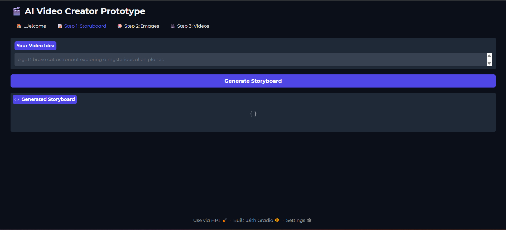
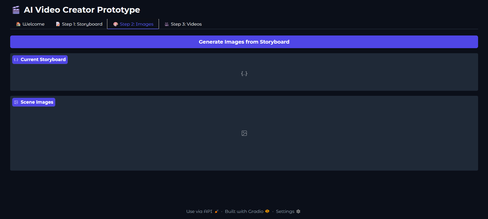

# 🎬 AI Video Creator Pipeline

This project is a prototype of an end-to-end pipeline that generates short, multi-scene videos from a single text prompt. It leverages a series of state-of-the-art, open-source AI models, each specialized for a different part of the creative process, all wrapped in a simple, user-friendly web interface.

The core workflow is designed to mimic a real production studio:

1. **The Director (LLM):** Creates a script and storyboard.
2. **The Art Department (Text-to-Image):** Generates concept art for each scene.
3. **The Animation Studio (Image-to-Video):** Animates the concept art into video clips.

---

## ✨ Features

- **Multi-Step Guided UI:** A tabbed web interface (Gradio) guides the user through the video creation process.
- **State-of-the-Art Models:** Uses separate models for LLM, image generation, and video generation for best results.
- **Modular Architecture:** Clear folder/module separation so components can be swapped or upgraded easily.
- **Automated Pipeline:** Outputs from one model feed into the next with minimal manual overhead.

---

## 🖼️ Screenshots

> Replace the placeholders below with your screenshots inside `./docs/` and update the markdown links.

| **Step 1: Storyboard Generation** | **Step 2: Image Generation** |
| --- | --- |
|  |  |
| **Step 3: Video Clip Generation** | **Final Output Example** |
|  |  |

**How to add screenshots:**

1. Create a `docs/` folder in the project root.  
2. Save your screenshots as `screenshot1.png`, `screenshot2.png`, etc.  
3. Commit & push the `docs/` folder to the repo.  
4. Update the image paths above if you use different filenames.

---

## 🛠️ Technology Stack

- **Director LLM:** `Meta-Llama-3.1-8B-Instruct`  
- **Image Generation:** `black-forest-labs/FLUX.1-dev`  
- **Video Generation:** `Wan-AI/Wan2.2-T2V-A14B`  
- **Web Framework:** `Gradio`  
- **Core Libraries:** `transformers`, `diffusers`, `torch`  
- **GPU Backend:** AMD ROCm

---

## 🚀 Quick Start

> These steps assume you're working on a Linux machine with an AMD GPU and have `git` installed.

### 1. Clone the repository

```bash
git clone https://github.com/YourUsername/ai-video-creator.git
cd ai-video-creator
```

### 2. Set up the Python environment

Create and activate a virtual environment, then install dependencies:

```bash
python3 -m venv venv
source venv/bin/activate
pip install -r requirements.txt
```

> Tip: Use `conda` or `pipx` if you prefer those tools — adapt the steps accordingly.

### 3. Download the AI models

The models are **not** included in this repo. Run the provided scripts to download them:

```bash
# Download the Llama 3.1 LLM
python download_llm.py

# Download the FLUX.1 Image Model
python download_image_model.py

# Download the Wan2.2 Video Model
# Note: Wan2.2 may require cloning a separate repo first — see the Wan2.2 repo page.
```

Place the downloaded model folders inside `./models/` (e.g., `./models/llama-3.1/`, `./models/flux1/`, `./models/wan2.2/`). The repo includes `.gitkeep` placeholders demonstrating the expected structure.

### 4. Install Wan2.2-specific dependencies

Wan2.2 has its own dependencies. Install them inside the same virtual environment (or a dedicated one):

```bash
cd Wan2.2
pip install -r requirements.txt
cd ..
```

> Note: You may need system-level packages (FFmpeg, libsndfile, build tools). Follow Wan2.2 repo instructions if you encounter errors.

### 5. Configure model paths (optional)

If you store models outside `./models`, create a `.env` or update `config/*.yaml` with the correct paths. Example `.env`:

```
MODEL_DIR=./models
LLM_PATH=./models/llama-3.1
IMAGE_MODEL_PATH=./models/flux1
VIDEO_MODEL_PATH=./models/wan2.2
```

---

## (Usage)

Start the app from the project root:

```bash
python app.py
```

The app will load the models (this may take several minutes). Gradio will print a local URL such as `http://localhost:7860` and, optionally, a public `*.gradio.live` sharing URL.

**Important:** Model loading is resource-intensive. On ROCm setups, ensure PyTorch/ROCm and drivers are installed and tested first.

---

## Workflow (UI)

1. **Welcome Tab** — Overview + quick-start instructions.  
2. **Step 1: Storyboard Tab** — Enter a video idea and click **Generate Storyboard**. The LLM outputs scenes, shot descriptions, and recommended camera moves/timings.  
3. **Step 2: Images Tab** — Generate and review concept art for each scene. Regenerate or refine prompts as needed.  
4. **Step 3: Videos Tab** — Render short video clips from the images. Preview, download, and iterate.

Outputs are saved to `./outputs/` with a timestamped folder for each run.

---

## 🗺️ Roadmap

This project is a prototype with many future improvements planned:

- [ ] **Video Stitching:** Combine generated clips into a single MP4.  
- [ ] **Audio Generation:** Add TTS voiceover generation for scenes.  
- [ ] **Background Music:** Integrate music generation or royalty-free music templates.  
- [ ] **Improved Error Handling:** Better model failure handling and user feedback.  
- [ ] **Asset Management:** Re-usable prompts, templates, and image libraries.  
- [ ] **User Accounts & Projects:** Save projects, history, and exports.  
- [ ] **Performance Optimizations:** Mixed precision, attention slicing, tiled generation, and model serving optimizations for ROCm.  
- [ ] **Export Presets:** Provide web/social/high-quality export presets.

---

## Contributing

Contributions are welcome! Suggested guidelines:

1. Fork the repo and create a feature branch.  
2. Write tests for new functionality where applicable.  
3. Open a PR with a clear description of changes.  

If you add new models or major changes, please update this README and the `requirements.txt` accordingly.

---

## Troubleshooting

- **OOM Errors:** Reduce image resolution or batch sizes. Consider swapping to a smaller model or using mixed precision.  
- **ROCm Issues:** Ensure your ROCm/PyTorch version is compatible with your GPU and OS (Ubuntu 22.04+ is recommended for recent ROCm).  
- **Wan2.2 Build Failures:** Check system dependencies (FFmpeg, gcc, libsndfile). Consult the Wan2.2 repo for platform-specific instructions.

If you still hit problems, open an issue with logs and environment details (OS, Python, PyTorch/ROCm versions, GPU model).

---

## Files & Folders (suggested)

```
ai-video-creator/
├─ app.py
├─ requirements.txt
├─ download_llm.py
├─ download_image_model.py
├─ models/        # place model directories here
├─ Wan2.2/        # optional submodule or local folder for Wan2.2
├─ outputs/       # generated images/videos go here
├─ docs/          # screenshots and documentation images
├─ config/        # yaml/json configs and sample .env
└─ README.md
```

---

## License & Credits

Add your preferred license file (e.g., `LICENSE`) and include credits for any models or third-party code you re-use. Many models are released under different terms — check each model's license before redistribution.

---

## Contact

If you'd like help setting this up for ROCm, creating `.env`/`config.sample.yaml`, or automating downloads with scripts, open an issue or reach out to `you@example.com` (replace with your contact).

---

*Generated with ❤️ — paste this `README.md` into your repo and edit the placeholders (model names, repo URL, contact) as needed.*

